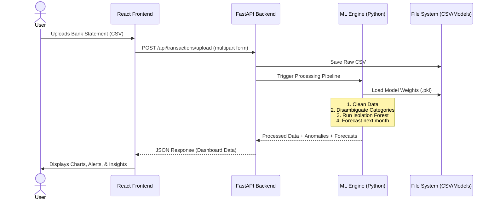
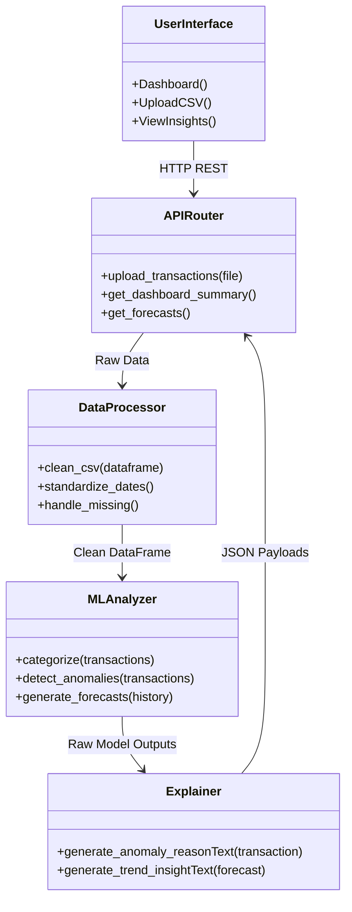

# FINMATE: System Architecture & Design

## 1. System Architecture Diagram

The FINMATE system is built on a modern, decoupled client-server architecture, allowing for scalability, easy maintenance, and future migration to mobile or cloud-native setups.

```mermaid
graph TD
    %% Client Tier
    subgraph Frontend [Client Tier (React + Vite)]
        UI[User Interface]
        Pages[Dashboard, Insights, Settings]
        Comps[Reusable Components]
        State[React Context / Hooks]
        API_Client[Axios API Client]
        
        UI --> Pages
        Pages --> Comps
        Pages --> State
        State --> API_Client
    end

    %% API Tier
    subgraph Backend [Backend API Tier (FastAPI)]
        Router[FastAPI Routers]
        Service[Business Logic Services]
        Router --> Service
    end

    %% Analytics Tier
    subgraph MachineLearning [Machine Learning & Analytics Tier]
        Preprocess[Data Preprocessing pipeline]
        Categorizer[Rule + ML Categorization]
        Anomaly[Isolation Forest Anomaly Detection]
        Forecast[ARIMA/Linear Regression Forecaster]
        Models[(Saved .pkl Models)]
        
        Categorizer --- Models
        Anomaly --- Models
        Forecast --- Models
    end

    %% Data Tier
    subgraph Data [Data Tier]
        CSV[(Raw CSV Storage)]
        ProcessedCSV[(Structured Processed Data)]
    end

    %% Interactions
    API_Client <-->|REST API (JSON)| Router
    Service --> Preprocess
    Preprocess --> Categorizer
    Preprocess --> Anomaly
    Preprocess --> Forecast
    
    Preprocess <--> CSV
    Service <--> ProcessedCSV
```

## 2. Data Flow Diagram (DFD Level 0)

1. **User** uploads a CSV file of transactions to the **FINMATE Frontend**.
2. **Frontend** transmits the CSV file to the **FastAPI Backend** via `/api/upload`.
3. **Backend** processes the CSV, cleans it, and triggers the **ML Pipeline**.
4. **ML Pipeline** reads the data, applies saved models `.pkl`, categorizes transactions, detects anomalies, and generates forecasts.
5. **Backend** constructs a unified JSON response containing the analysis and descriptive reasoning.
6. **Frontend** receives the JSON and updates the Dashboard Visualization.



## 3. Database Schema (CSV Data Structure - Phase 1)

While the project utilizes a lightweight CSV file storage approach initially, the columns are strictly defined to facilitate seamless migration to PostgreSQL or MySQL in Phase 2.

### `transactions.csv` (Core Table Equivalent)

| Column Name      | Data Type | Description                                        | Example                   |
|------------------|-----------|----------------------------------------------------|---------------------------|
| `transaction_id` | UUID      | Primary Key for the transaction                    | `123e4567-e89b-12d3...`   |
| `date`           | Date      | Transaction date (Standardized `YYYY-MM-DD`)       | `2023-06-15`              |
| `description`    | String    | Original bank description                          | `UBER *EATS PENDING`      |
| `amount`         | Float     | Transaction amount (Negative for debit)            | `-24.50`                  |
| `category`       | String    | ML-predicted or rule-based category                | `Food & Dining`           |
| `is_anomaly`     | Boolean   | Flagged by Isolation Forest algorithm?             | `False`                   |
| `anomaly_reason` | String    | Explainable AI reasoning (if anomaly)              | `Null`                    |

### `monthly_summaries.csv`

| Column Name      | Data Type | Description                                        | Example                   |
|------------------|-----------|----------------------------------------------------|---------------------------|
| `month_year`     | String    | Aggregation month indicator                        | `2023-06`                 |
| `total_in`       | Float     | Total income for month                             | `5000.00`                 |
| `total_out`      | Float     | Total expenditure for month                        | `3250.75`                 |
| `savings_rate`   | Float     | Percentage of income saved                         | `34.98%`                  |

## 4. Module Interaction Diagram



## 5. Folder Structure Definition

```text
FINMATE/
├── frontend/                 # React UI Tier
│   ├── src/
│   │   ├── components/       # Reusable UI Elements (Cards, Charts, Tables)
│   │   ├── pages/            # View specific components (Dashboard, Settings)
│   │   ├── services/         # API integration (axios calls)
│   │   ├── context/          # Global state management
│   │   ├── utils/            # Helper functions for formatting
│   │   ├── assets/           # Images, logos
│   │   ├── index.css         # Tailwind directives + custom styles
│   │   └── App.jsx           # Main routing wrapper
│   └── package.json
├── backend/                  # FastAPI Tier
│   ├── app/
│   │   ├── routers/          # API endpoints (/upload, /insights, /summary)
│   │   ├── services/         # Business logic mapping
│   │   ├── models/           # Pydantic schemas for data validation
│   │   ├── ml/               # Machine Learning modules (Anomaly, Category, Forecast)
│   │   ├── data/             # CSV storage (Phase 1)
│   │   ├── saved_models/     # Pre-trained .pkl files
│   │   └── utils/            # Logging, config, explainability generation
│   ├── main.py               # FastAPI application entrypoint
│   └── requirements.txt
├── docs/                     # Documentation and Academic Materials
│   └── (All markdown documentation files)
└── README.md
```
